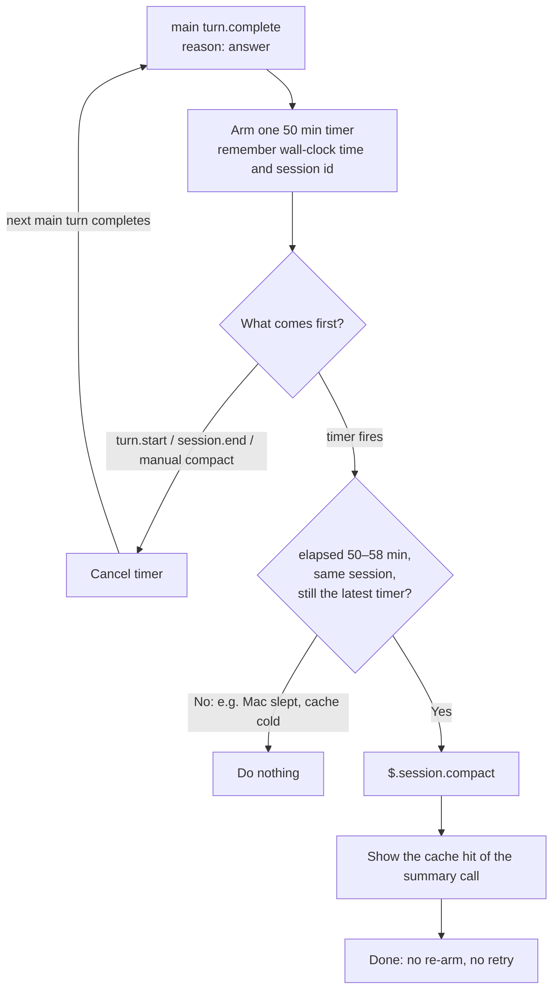

# Idle Compact

A Claude Code function-hooks plugin (Mod) that compacts the conversation **once** after 50 idle minutes, while the 1h prompt cache is still warm.

**In simple terms**: If you leave a long session alone, coming back after the 1h cache TTL re-caches the whole context. This plugin compacts shortly before that happens, so the next turn starts from a small, cheap context. It never keeps the cache alive, and it does nothing more after that one compaction.

> **⚠️ Note**: Function hooks are early access. Set `CLAUDE_CODE_ENABLE_FUNCTION_HOOKS=1` (for example in the `env` block of `~/.claude/settings.json`). Written against Claude Code 2.1.280; the cache hit line was checked on 2.1.282.

## How to Install (Plugin)

```
/plugin marketplace add takahirom/takahirom-claude-code-marketplace
/plugin install idle-compact@takahirom-claude-code-marketplace
```

## Execution Flow



- Only the main conversation arms the timer. Subagent completions (`agentId`), aborted or failed turns, and completions without a matching `turn.start` are ignored.
- The timer callback checks the wall clock (`$.clock.now()`) again. A timer that runs late, for example after the Mac slept, does nothing once 58 minutes have passed, because by then the cache may already be cold.
- The wall-clock anchor is the time `turn.complete` fired. Claude Code does not expose the cache's own last-activity time or TTL to plugins, so a session on the 5m TTL is not detected.
- Each time the timer is armed, one line in the conversation says when the compaction will happen, for example `idle-compact: compacts at 15:03 if nothing happens before then`. It is kept in the transcript but never sent to the model. After the idle compaction, one more line gives how much of the summary call's input came from the prompt cache, for example `idle-compact: compacted with a 95% cache hit (74,482 read, 326 written, 2,813 uncached)`; it is left out when Claude Code reports no usage for the compaction. Everything else goes to the debug log only (`--debug` / `--debug-file`).
- A failed compaction, one refused because a turn is running or because `DISABLE_COMPACT` is set, is ignored silently and not retried.

## Development

```sh
claude plugin validate plugins/idle-compact
CLAUDE_CODE_ENABLE_FUNCTION_HOOKS=1 claude plugin test plugins/idle-compact
```

Types come from `/plugin-types` (written to `.claude/types`, not committed).
